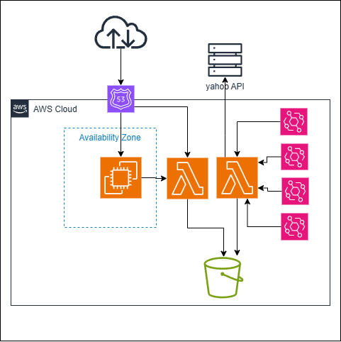

# Wine Classification Search API (Yahoo! Shopping)

Yahoo!ショッピングAPIを利用し、特定の格付け銘柄（クリュ・ブルジョワ、メドック格付けなど）を検索・抽出するAPIです。
ローカル開発用のシンプルなAPIと、AWSネイティブな構成（Collector/Reader分離アーキテクチャ）の両方をサポートしています。

## アーキテクチャ図


## 1. プロジェクト構成
- `data/`: 検索対象の銘柄マスタ（CSV）。プロジェクトのSource of Truth。
- `for_local/`: ローカル開発・検証用のFastAPI実装。
- `for_aws/`: AWSデプロイ用の構成。
    - `collector/`: マスタを読み込み、Yahoo! APIで定期的に検索を実行してS3に保存するLambda。
    - `reader/`: S3から最新の検索結果を取得して返す軽量なAPI Lambda。
    - `terraform/`: インフラ定義ファイル。
    - `operations/`: マスタデータの同期など、運用管理用スクリプト。
- `requirements.txt`: プロジェクト全体の依存関係。

---

## 2. ローカル開発セットアップ

### 2.1. 依存ライブラリのインストール
Python 3.10以上を推奨します。

```bash
# 仮想環境の作成（任意）
python -m venv venv
# Windows:
venv\Scripts\Activate.ps1
# Mac/Linux:
source venv/bin/activate

# インストール
pip install -r requirements.txt
```

### 2.2. Yahoo! Application ID の設定  
このAPIの実行には、Yahoo!ショッピングAPIの **Client ID (Application ID)** が必要です。  
※[商品検索v3](https://developer.yahoo.co.jp/webapi/shopping/v3/itemsearch.html)を利用しています。

1. [Yahoo!デベロッパーネットワーク](https://developer.yahoo.co.jp/)でアプリケーションを登録し、IDを取得します。
2. `for_local/` ディレクトリの中に `.env` ファイルを作成し、IDを以下の形式で保存してください。

```text
YAHOO_CLIENT_ID=あなたのアプリケーションID
```
※ `.env` ファイルは `.gitignore` に追加されており、Git管理対象外です。秘密情報の漏洩に注意してください。

### 2.3. 実行方法
APIサーバーを起動します。

```bash
cd for_local
python main.py
```
サーバーはデフォルトで `http://localhost:8000` で待機します。

---

## 3. AWS デプロイ手順 (WSL/Linux 推奨)

AWS環境では、大量の銘柄検索をバックグラウンド（Collector）で行い、結果を高速に配信（Reader）する分離アーキテクチャを採用しています。

### 3.1. インフラの構築 (Terraform)
1. AWS CLI の設定 (`aws configure`) が完了していることを確認してください。
2. Terraform を実行します。

```bash
cd for_aws/terraform
terraform init
terraform apply
```
※適用完了後、出力される `reader_api_url` と `s3_bucket_name` をメモしてください。

### 3.2. マスタデータの同期 (S3)
プロジェクトルートの `data/` 内のCSVファイルをS3にアップロードします。

```bash
# プロジェクトルートから実行
chmod +x for_aws/operations/upload_master.sh
./for_aws/operations/upload_master.sh <メモしたバケット名>
```

### 3.3. 動作確認
1. **Collectorの実行**: AWSコンソールから `collector` Lambda を開き、「Test」を実行して検索を開始します。
2. **Readerの確認**: Terraformが出力した `reader_api_url` にアクセスして結果を取得します。
   - 例: `https://xxxx.lambda-url.ap-northeast-1.on.aws/search/medoc`

---

## 4. APIの使い方（ローカル実行時）

### 検索エンドポイント (`/search` または `/search/{classification}`)

#### A. 全ての格付けを検索
`data/` ディレクトリ内の全てのサブフォルダに含まれる銘柄を検索します。

- **URL**: `GET /search`
- **クエリパラメータ**:
    - `min_price`: 最低価格 (オプション)
    - `max_price`: 最高価格 (オプション)

#### B. 特定の格付けを指定して検索
特定のフォルダ（例: `cru_bourgeois`）内の銘柄のみを検索します。

- **URL**: `GET /search/{classification}`
- **パスパラメータ**:
    - `classification`: 格付けフォルダ名 (例: `cru_bourgeois`)
- **クエリパラメータ**:
    - `min_price`: 最低価格 (オプション)
    - `max_price`: 最高価格 (オプション)

#### 使用例1: クリュ・ブルジョワを0円〜2500円の範囲で検索
```bash
curl "http://localhost:8000/search/cru_bourgeois?min_price=0&max_price=2500"
```

#### 使用例2: 格付けを指定せずに0円〜2500円の範囲で検索
```bash
curl "http://localhost:8000/search?min_price=0&max_price=2500"
```

---

## 5. マスタデータの管理
検索対象の銘柄は `data/{格付け名}/{年度}.csv` の形式で管理しています。

例: `data/cru_bourgeois/2020.csv`

各CSVファイルには以下のカラムを含めます：
- `chateau_name`: 仏語名称（表示用）
- `appellation`: AOC
- `search_name_ascii`: アルファベットの検索用キーワード
- `search_name_kana`: カタカナの検索用キーワード（**最もヒット率が高いため重要**）

※新しい年度のリストを追加した場合は、AWS環境では「3.2. マスタデータの同期」を再実行することで自動的に検索対象に含まれます。

## 6. ライセンス
このプロジェクトは [MIT License](LICENSE) の下で公開されています。

---

**注意**: 本ツールは個人の利用を目的としており、Yahoo!ショッピングAPIの[利用約款](https://developer.yahoo.co.jp/webapi/shopping/api_contract.html)を遵守して使用してください（1秒間に1リクエストの制限を自動で適用しています）。
